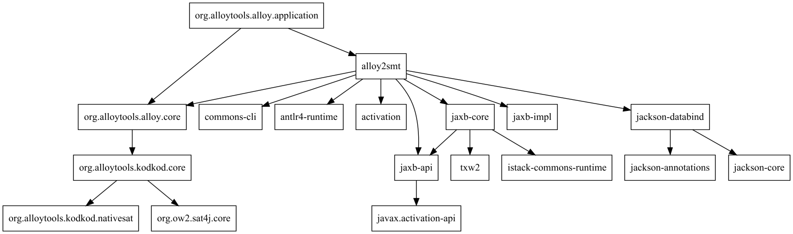

# Alloy

Alloy 4 is a self-contained executable, which includes the Kodkod
model finder and a variety of SAT solvers, as well as the standard
Alloy library and a collection of tutorial examples. The same jar file
can be incorporated into other applications to use Alloy as an API,
and includes the source code. See the release notes for details of new
features. 

More documentation can be found at: http://alloytools.org/documentation.html.

# Requirements

Alloy runs on all operating systems with a recent JVM (Java 8 or later). 
It is made available as a runnable jar file with both a cross-platform SAT solver
([Sat4j](http://www.sat4j.org/) and more efficient native SAT solvers ([minisat](http://minisat.se), [lingeling/plingeling](http://fmv.jku.at/lingeling/), [glucose](http://www.labri.fr/perso/lsimon/glucose/)).

Note however that starting with macOS High Sierra, it is necessary to install a dedicated
JVM to run Alloy on macOS. A `.pkg` file is provided for that purpose.

# TL;DR

Checkout the project and type `./gradlew alloyCVC4`. You find the executable JAR in bin/alloy_cvc4.jar after the build has finished.

     $ java -version
     java version "11.0.1" 2018-10-16 LTS
     Java(TM) SE Runtime Environment 18.9 (build 11.0.1+13-LTS)
     Java HotSpot(TM) 64-Bit Server VM 18.9 (build 11.0.1+13-LTS, mixed mode)
     $ git clone https://github.com/CVC4/org.alloytools.alloy
     $ cd org.alloytools.alloy     
     $ ./gradlew alloyCVC4
     $ cd bin
     $ chmod +x cvc4_linux
     $ java -jar alloy_cvc4.jar
     # opens GUI

Note: if you are behind a proxy, the call to `gradlew` is likely to fail, unless you pass it further options about the http and https proxies (and possibly your login and password on this proxy). There are several ways to pass these options, a simple one is to type (replace the `XXXXX`'s by the adequate settings):

     $ ./gradlew -Dhttps.proxyHost=XXXXX -Dhttp.proxyHost=XXXXX -Dhttp.proxyPort=XXXXX \
          -Dhttps.proxyPort=XXXXX -Dhttp.proxyUser=XXXXX -Dhttp.proxyPassword=XXXXX \
          -Dhttps.proxyUser=XXXXX -Dhttps.proxyPassword=XXXXX \
          build

## Building Alloy

The Alloy build is using a gradle wrapper `./gradlew build` which will install gradle or `./gradle build` if it is already installed. 

To build alloy without running the tests use the command `./gradlew alloyCVC4` in Linux and `gradlew.bat alloyCVC4` in Windows. When the build finishes, a jar file `bin/alloy_cvcr.jar` will be generated. 

To get a clean build run `./gradlew clean build` or `./gradlew clean alloyCVC4`

### Projects

The workspace is divided into a number of projects:

* [org.alloytools.alloy.application](org.alloytools.alloy.application) – Main application code includes the parser, ast, visualiser, and application code
* [org.alloytools.alloy.extra](org.alloytools.alloy.extra) – Models and examples
* [org.alloytools.kodkod.core](org.alloytools.kodkod.core) – Kodkod without native code
* [org.alloytools.kodkod.native](org.alloytools.kodkod.native) – The native code libraries for kodkod
* [alloy2smt](alloy2smt) – The translator from alloy model to [CVC4](http://cvc4.cs.stanford.edu/downloads/)) smt-lib 

### Projects dependency graph

### Gradle 

In the root of this workspace type `./gradlew build`. This is a script that will download the correct version of gradle and run the build scripts. For settings look at [settings.gradle].

### Eclipse

### IntelliJ IDEA

1. Choose "Import Project"
2. Select the `org.alloytools.alloy` directory.
3. Choose "Import project from external model: Gradle" and click "Next"
4. For project SDK, Choose at least "1.8", Click Finish

To run the Alloy GUI within IDEA, navigate to
org.alloytools.alloy.application/src/main/java/edu/mit/csail/sdg/alloy4whole/SimpleGUI and run the SimpleGUI class.

Alternatively you can use gradle to build the project and then run the jar file `bin/alloy_cvc4.jar`

### Continuous Integration

The workspace is setup to build after every commit using Travis. It releases snapshots to `https://oss.sonatype.org/content/repositories/snapshots/org/alloytools/` for every CI build on Travis.

### Building the DMG file for OSX systems

## CONTRIBUTIONS

Please read the [CONTRIBUTING](CONTRIBUTING.md) to understand how you can contribute.

[javapackager]: https://docs.oracle.com/javase/8/docs/technotes/guides/deploy/packager.html
