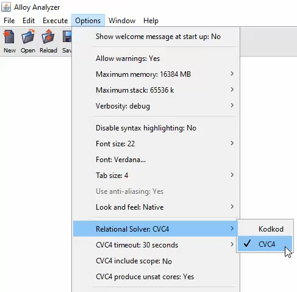

# The CVC4 Relational Solver 

This Alloy Analyzer plugin provides an alternative relational solver that extends the capabilities of the Analyzer with 
* the ability to prove an Alloy model inconsistent or an assertion valid _regardless signature scope_;
* support for constraints over _unbound_ (i.e., mathematical) integers. 

With this relational solver, signatures have by default *unbounded scope* and integers are not bound by any particular bit width.

The CVC4 Relational Solver uses as backend the SMT solver [CVC4](https://cvc4.github.io) through CVC4's direct support for the theory of finite relations. Because of that, _the relational solver assumes that all user-defined signatures in an Alloy model are finite._ The only builtin signature that is currently supported is `Int` which is interpreted as the (infinite) set of mathematical integers. A later extension may include the builtin signature `String`, interpreted as the set of all strings of Unicode characters.

## Installation

CVC4 binaries for Windows, macOS and Linux are included in the release alloy_cvc4.zip at https://github.com/CVC4/org.alloytools.alloy/releases . If you prefer to build the CVC4 binary yourself, the latest version of CVC4 can be downloaded from [here](https://cvc4.github.io/downloads.html). 

To build and run the latest version of alloy_cvc4 in Linux run the commands:
```cmd
git clone https://github.com/CVC4/org.alloytools.alloy
cd org.alloytools.alloy
./gradlew alloyCVC4
cd bin
chmod +x cvc4_linux
java -jar alloy_cvc4.jar &
```
The build process for macOS is analogous. For Windows, do the following:

```cmd
git clone https://github.com/CVC4/org.alloytools.alloy
cd org.alloytools.alloy
gradlew.bat alloyCVC4
cd bin
java -jar alloy_cvc4.jar
```

## CVC4 options 

The CVC4 Relational Solver can be chosen from the the options menu. 



**CVC4 timeout.** can also be set there, in seconds. This is the time alloted to CVC4 to solve a particular Alloy command (`run`, `check`, or `execute all`). The default timeout is 30 seconds.  

**CVC4 include scope.** specifies whether to consider or ignore the scope constraints in all commands. _By default the scope is disabled._
In the following example, the CVC4 Relational Solver returns the empty set for signature `A` when the scope option is disabled. 

```cmd
sig A {}
run {} for exactly 3 A
```

If the model itself or a run scenario requires a signature's size to be bounded, one should express that with cardinality constraints. The following example has the same effect that the previous one when analyzed with the default KodKod relational solver. 

```cmd
sig A {}
run {#A = 3} 
```

The CVC4 Relational Solver returns 3 elements for signature A. 

**Note:** Cardinality constraints are currently supported only as atomic constraints of the form 
```
#r op n
```

where `r` is a relational expression, `n` is a numeral and `op` is a builtin arithmetic relational operator (`<`, `>`, `>=`, `=<`, `=`, `!=`)


**CVC4 produce unsat core.** Enabling this option will show the unsat core of an inconsistent model or a valid assertion.


## Differences with Alloy Semantics

The additional capabilities provided by the CVC4 Relational Solver come at the cost of some departures from the Alloy standard semantics, which results in different behavior in a number of cases. These differences are illustrated below. 

### Integer signatures 

The CVC4 Relational Solver conforms to the Alloy type system with the exception of prohibiting the construction of relational terms that mix integer and non-integer elements. For example, it considers the body of following predicate ill-typed although it is well-typed (and always true) in standard Alloy
```
pred p {univ & Int = Int} // Int is a subset of univ
```

More precisely, it is not possible to write expressions denoting a set that contains both integers and atoms (i.e., elements of a user-defined signature). Such expressions are rejected by the CVC4 Relational Solver as ill-typed. 
Example:
````
sig A {}
sig B {
    f: A + Int  //  A + Int is considered ill-typed
}
````

Note that terms like `A + Int` are well-typed (and so allowed) in Alloy. _The restriction above is specific to the CVC4 Relational Solver_ although it does not appear to be a major one in common usage. Its rationale is that it greatly facilitates the translation of Alloy models to CVC4 whose type system has only simple types and no subtypes. 

One consequence of this restrictions is that, contrary to the standard Alloy semantics, _`univ` is considered to consist only of the union of all the top-level user-defined signatures_ and so it contains no integers. Correspondingly, _`iden` ranges over pairs of atoms only._ 
For the integers, the CVC4 Relational Solver then adds two new builtin constants: `univInt` and `idenInt` where 

1. `univInt` denotes a finite subset of integers that includes all the user-defined subsignatures of `Int` as well as any builtin constants (such as 0,1, and so on) occurring in the model; 
2. `idenInt` denotes the identity relation over `univInt`. 


**Note**: Because of the restriction of the CVC4 Relational Solver to finite sets, the predefined signature `Int` _is currently identified with_ `univInt` when used in a formula. For example, the formula 
````
all x : Int | x > 1 implies x > 0
````
is actually treated as if it was 
````
all x : univInt | x > 1 implies x > 0 
````
In other words, it is not possible to actually quantify over all integers, but only over a finite subset of them (denoted by `univInt` and determined by the solver) that is large enough to contain all the user-defined subsignatures of `Int` and any integer constant appearing in the model.
In future versions, to avoid possible misunderstanding on the user's part, it might be better to simply disallow the use of `Int` in formulas and permit it only in signature declarations, as in the model fragment below, instead of silently treating `Int` as `univInt`.
````
sig A, B in Int {}

// allowed since A is finite
fact {all a : A | 0 <= a and a < 11}  

// allowed since univInt is finite
fact {all a : univInt | 0 <= a and a < 51}

// Disallowed, should raise an error
fact {all a : Int | (0 <= a and a < 21) => a in univInt}
fact {all a : Int - A | a !in B}
fact {all a : A | a !in Int & B}
````
### Semantics of Integer Operators

The CVC4 Relational Solver interprets the builtin relational constants `plus`, `minus`, `mul`, `div`, and `rem` differently from standard Alloy, and more consistently with Alloy's use of square brackets as syntactic sugar for relational join. Specifically, it uses the following semantics where, because of the restrictions above, `A` and `B` can only be expressions denoting finite sets:

| Syntax        | Alt. Syntax | Meaning                              |
|---------------|----------|-----------------------------------------|
| `plus[A, B]`  | `B.A.plus`  | { z \| ∃ x ∈ A, y ∈ B. x + y = z }   |
| `minus[A, B]` | `B.A.minus` | { z \| ∃ x ∈ A, y ∈ B. x - y = z }   |
| `mul[A, B]`   | `B.A.mul`   | { z \| ∃ x ∈ A, y ∈ B. x * y = z }   |
| `div[A, B]`   | `B.A.div`   | { z \| ∃ x ∈ A, y ∈ B. x / y = z }   |
| `rem[A, B]`   | `B.A.rem`   | { z \| ∃ x ∈ A, y ∈ B. x mod y = z } |

 
 **Example**

````
 sig A, B, C in Int {} 
 fact { 
     A = 1 + 2   // A is the union of singleton sets 1 and 2
     B = 4 + 5
     C = plus[A, B]
 } 
run {} for 5 Int, 12 seq
````

The result returned from CVC4 Relational Solver is 
```cmd
this/A={1, 2}
this/B={4, 5}
this/C={5, 6, 7}
```

**Note:** Because of the restriction to finite relations, the operators above must be fully applied. In other words, expressions like `plus[A]` or `x in A.plus` are not allowed. This guarantees that an expression like `plus[A, B]` denotes a finite set. In the last example above, in effect it is as if `plus` was the relation 

````
{ (1, 4, 5), (1, 5, 6), (2, 4, 6), (2, 5, 7) }
````

Then `C` is just the relation `B.A.plus`, that is, `{5, 6, 7}`.


Compare this with the result returned by Kodkod, the default relational solver in Alloy, which, in accordance with the Alloy reference document, interprets `plus[A, B]` as the result of adding the sum (3) of all the elements of `A` with the sum (9) of all the elements of `B`. 
```
this/A={1, 2}
this/B={4, 5}
this/C={12}
```
When the operands are singletons, the semantics of CVC4 Relational Solver is similar to that of the Kodkod solver (modulo the bit width), as shown in the following example:
```cmd
sig A, B in Int {} 
fact { 
    plus[A, B] = 6
    minus[A, B] = 2
    #A = 1
    #B = 1
}
run {} for 4 Int, 7 seq
```
CVC4 and Kodkod result:
```cmd
this/A={4}
this/B={2}
```

**Note:** Despite supporting the application of the arithmetic operators to arbitrary finite sets of integers, the CVC4 relation solver targets the case when their arguments are singletons. Performance degrades significantly as the cardinality of the argument sets increases.


### Semantics of Integer Comparison

The semantics of comparison operators: `<`, `=<`, `>`, `>=`  also differs from the standard one in that it effectively considers only the case when their arguments are singletons:

| Syntax | Meaning                                  |
|--------|------------------------------------------|
| A =< B | ∃ x, y ∈ Z. A = {x}, B = {y}, and x <= y |
| A < B  | ∃ x, y ∈ Z. A = {x}, B = {y}, and x < y  |
| A >= B | ∃ x, y ∈ Z. A = {x}, B = {y}, and x >= y |
| A > B  | ∃ x, y ∈ Z. A = {x}, B = {y}, and x > y  |

In contrast, in the standard Alloy semantics the comparison is made between the sum of all the elements in A and the sum of all elements in B. The following examples illustrates the difference between the two semantics:
```cmd
sig A, B in Int {} 
fact { 
  A > B
  #A = 2   
}
run {} for 4 Int, 7 seq
```

The CVC4 Relational Solver finds this model inconsistent because it is not possible for `A` to be simultaneously a singleton and have cardinality 2. In contrast, the Kodkod solver returns the model
```cmd
this/A={-7, 2}
this/B={-4, -5, -7, -8, 1}
``` 
 which satisfies the model because [-7 + 2]<sub>8</sub> = [3]<sub>8</sub> >  = [1]<sub>8</sub> = [-4 + -5 + -7 + -8 + 1]<sub>8</sub> which satisfies 3 > 4. 
 
When both operands are singletons, the two semantics are effectively the same. Both solvers return sat for this model
```cmd
sig A, B in Int {} 
fact { 
  A > B
  #A = 1
  #B = 1   
}
run {} for 4 Int, 7 seq
```


## Unsupported features
Currently the following Alloy features are not fully supported by CVC4 Relational Solver:
- The cardinality operator in expressions (e.g., `sig A,B {r: A} fact {#A + 2 = 3 and #B < #A}`) unless it is used for a direct comparison with an integer constant. So expressions like `#A + 2 = 3 and #B < #A}` are not supported whereas expressions like `#A = 3`, `#A > 2`, `#A >= 2`, `#A < 4`, `#A <= 4`, `4 >= #A` are supported.
- Running the command line interface of Alloy (only the GUI is supported).


## Examples

See [examples](../examples) for a list of simple examples. 