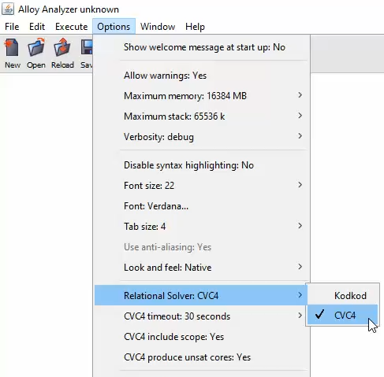

# CVC4 relational solver 
CVC4 relational solver extends Alloy with proving unsatisfiable models and supporting mathematical integers. It is not restricted by **signatures scope**, **integer bit width**, or **integer sequence**. 
The relational solver uses the relation theory in the SMT solver [CVC4](https://cvc4.github.io).
CVC4 binaries for Windows, macOS and Linux are included in the release [alloy_cvc4.zip](https://github.com/CVC4/org.alloytools.alloy/releases/download/v5.0.0.2/alloy_cvc4.zip). The latest version of CVC4 can be downloaded from [here](https://cvc4.github.io/downloads.html). To build the latest version of alloy_cvc4 run the commands:
```cmd
git clone https://github.com/CVC4/org.alloytools.alloy
cd org.alloytools.alloy     
git checkout cvc4
cd bin
java -jar alloy_cvc4.jar     
```
# CVC4 options 
The relational solver CVC4 can be chosen from the the options menu. CVC4 timeout can also be set there.  



# Integer signatures 
## Semantics of functions plus, minus, mul, div, rem
 CVC4 relational solver interprets integer signatures as sets of mathematical integers. It uses different semantics for functions plus, minus, mul, div, and rem as follows: 

- plus[A, B] = {z | &#8707; x &#8712; A, y &#8712; B. x + y = z}
- minus[A, B] = {z | &#8707; x &#8712; A, y &#8712; B. x - y = z}
- mul[A, B] = {z | &#8707; x &#8712; A, y &#8712; B. x * y = z}
- div[A, B] = {z | &#8707; x &#8712; A, y &#8712; B. x / y = z}
- rem[A, B] = {z | &#8707; x &#8712; A, y &#8712; B. x mod y = z}
 
 **Example**
 ```
 sig A, B, C in Int {} 
 fact { 
     A = 1 + 2
     B = 4 + 5
     C = plus[A, B]
 } 
run {} for 5 Int, 12 seq
```
The result returned from CVC4 relational solver is 
```
this/A={1, 2}
this/B={4, 5}
this/C={5, 6, 7}
```
In this example `C = plus[A, B]` acts like there exists a relation `plus={1->4->5, 1->5->6, 2->4->6, 2->5->7}` where `C = B.(A.plus)`.
Compare this with the result returned from Kodkod solver which interprets an integer signature as the sum of its elements. 
```
this/A={1, 2}
this/B={4, 5}
this/C={12}
```
When the operands are singletons, the the semantics of CVC4 relational solver is similar to the Kodkod solver (modulo bitwidth) as shown in the following example:
```
sig A, B in Int {} 
fact { 
    plus[A, B] = 6
    minus[A, B] = 2
    #A = 1
    #B = 1
}
run {} for 4 Int, 7 seq
```
CVC4 and Kodkod Result
```
this/A={4}
this/B={2}
```

To avoid performance issues, it is recommended to use only singletons for integer signatures by restricting their cardinality to be 1. Otherwise, the performance would degrade significantly as the cardinality increases.     

## Comparisons
Semantics for comparison operators: <, =<, >, >=  is based on singletons as follows:
- A =< B ≡ ∃ x, y ∈ Z. A = {x} and B = {y} and x <= y
- A < B ≡ ∃ x, y ∈ Z. A = {x} and B = {y} and x < y
- A >= B ≡ ∃ x, y ∈ Z. A = {x} and B = {y} and x >= y
- A > B ≡ ∃ x, y ∈ Z. A = {x} and B = {y} and x > y

This is different than Kodkod semantics which compares between the sum of the two operands. The following examples compares between them:
```
sig A, B in Int {} 
fact { 
A > B
#A = 2   
}
run {} for 4 Int, 7 seq
```

CVC4  solver returns unsat for this model because when #A = 2, A = {x}  for some x is false which makes A > B always false. However Kodkod solver returns 
```
this/A={-7, 2}
this/B={-4, -5, -7, -8, 1}
``` 
 Which is congruent to $A=[(-7 + 2) mod 8] = [3] $
 and $B=[(-4 + -5 + -7 + -8 + 1) mod 8 ] = [1]$ which satisfies 3 > 4
# Examples

# Unsupported alloy features 

