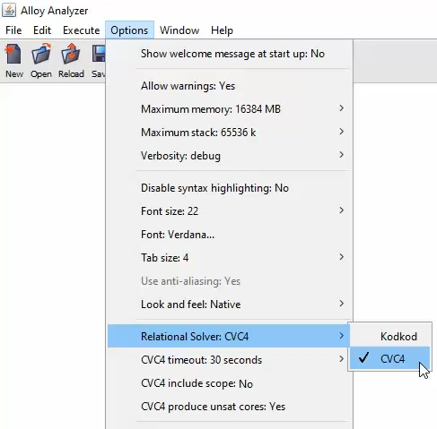

# CVC4 relational solver 

This Alloy Analyzer plugin provides an alternative relational solver that extends the capabilities of the Analyzer with 
* the ability to prove an Alloy model inconsistent or an assertion valid _regardless signature scope_;
* support for constraints over _unbound_ (i.e., mathematical) integers. 

With this relational solver, signatures have by default *unbounded scope* and integers are not bound by any particular bit width.

The relational solver uses as backend the SMT solver [CVC4](https://cvc4.cs.stanford.edu/web) through CVC4's direct support for the theory of finite relations. Because of that the relational solver assumes that all user-defined signatures in an Alloy model are finite. The only builtin signature that is currently supported is `Int` which is interpreted as the (infinite) set of mathematical integers. A later extension may include the builtin signature `String`, interpreted as the set of all strings of Unicode characters.

CVC4 binaries for Windows, macOS and Linux are included in the release [alloy_cvc4.zip](https://github.com/CVC4/org.alloytools.alloy/releases/download/v5.0.0.4/alloy_cvc4.zip). The latest version of CVC4 can be downloaded from [here](https://cvc4.github.io/downloads.html). To build the latest version of alloy_cvc4 in Linux run the commands:
```cmd
git clone https://github.com/CVC4/org.alloytools.alloy
cd org.alloytools.alloy     
git checkout cvc4
./gradlew alloyCVC4
cd bin
chmod +x cvc4_linux
java -jar alloy_cvc4.jar     
```
The build process for macOS is analogous. For Windows

```cmd
git clone https://github.com/CVC4/org.alloytools.alloy
cd org.alloytools.alloy     
git checkout cvc4
gradlew.bat alloyCVC4
cd bin
java -jar alloy_cvc4.jar     
```

[MM: add windows instructions].

# CVC4 options 

The CVC4 relational solver can be chosen from the the options menu. 



**CVC4 timeout** can also be set there, in seconds. This is the time alloted to CVC4 to solve a particular Alloy command (run, check, or execute all). The default timeout is 30 seconds.  

**CVC4 include scope** specifies whether to consider or ignore the scope constraints in all commands. By default the scope is disabled. 
In the following example, the CVC4 relational solver returns the empty set for signature `A` when the scope option is disabled. 

```cmd
sig A {}
run {} for exactly 3 A
```

If the model itself or a run scenario requires a signature's size to be bounded, one should express that with cardinality constraints. The following example has the same effect that the previous one when analyzed with the KodKod relational solver. 

```cmd
sig A {}
run {#A = 3} 
```

The CVC4 relational solver returns 3 elements for signature A. 

**Note:** Cardinality constraints are supported only as atomic constraints of the form 
```
#r op n
```

where `r` is a relational expression, `n` is a numeral and `op` is an builtin arithmetic relational operator (`<`, `>`, `>=`, `=<`, `=`, `!=`)

# Integer signatures 

_[CT: rewrite this part.
The quantifier discipline will be the following
  Int is allowed in quantifier restrictions only if the polarity of the quantifier is existential or the whole restriction is a finite relation.
  (the finiteness computation is approximated because it is not computable precisely)]_

With the CVC4 relational solver the builtin signature `Int` is interpreted as the set of all  integers. Since the solver can only reason about finite sets, it is not possible to universally quantify directly over `Int`. For instance, the following assertion will be rejected 
````
// generates error
assert a1 { all x : A & Int | x > 1 implies x > 0 }  
````
However, universally quantifying over a user-defined subset of `Int` is allowed since such subsets are implicitly considered to be finite:
````
sig A {} in Int

assert a1 {all x : A | x > 1 implies x > 0}  // allowed

check a1
````

<!-- 
[check] 
Existential quantification over `Int` is instead allowed. 
More precisely, in a fact, existential quantification over `Int` is allowed if, and only, the quantified formula has positive polarity. Dually, universal quantification over `Int` is allowed if, and only, the quantified formula has negative polarity. The other quantifiers are treated similarly. In an assertion, the same rule apply but with respect to the negation of the assertion. 
-->

Another limitation is that it is not possible to write expressions denoting a set that contains both integers and non-integers (i.e., atoms included in a user-defined signature). Such expressions are rejected by the relational solver as ill-typed. 
Example:
````
sig A {}
sig B {
    f: A + Int  //  A + Int is considered ill-typed
}
````

Note that currently something like `A + Int` is well-typed and allowed in Alloy. _The restrictions above are specific to the CVC4 relational solver._ One consequence of these restrictions is that _`univ` is considered to consists of all non-integer atoms only_. Similarly, `ident` ranges over pairs of atoms only. 
[CT: univ is _not_ the set of all atoms. It is just the union of the top level non-integer signatures.
]
[Note: For integers, we will need the Alloy developers to add two new builtin constants: `int_univ` and `int_ident` denoting respectively 
1. a finite set that includes all the integer signatures and builtin constants (0,1,...) occurring in the model
2. the identity relation over `int_univ`. 
]

## Semantics of functions plus, minus, mul, div, rem

The CVC4 relational solver interprets the builtin relational constants `plus`, `minus`, `mul`, `div`, and `rem` differently from the standard Alloy, and more consistently with the use of square brackets as syntactic sugar for relational join. Specifically, it uses the following semantics where, because of the restrictions above, `A` and `B` can only be expressions denoting finite sets:

| Syntax        | Alt. Syntax | Meaning                      |
|---------------|----------|-----------------------------------------|
| `plus[A, B]`  | `B.A.plus` | { z \| ∃ x ∈ A, y ∈ B. x + y = z }   |
| `minus[A, B]` | `B.A.minus` | { z \| ∃ x ∈ A, y ∈ B. x - y = z }   |
| `mul[A, B]`   | `B.A.mul`   | { z \| ∃ x ∈ A, y ∈ B. x * y = z }   |
| `div[A, B]`   | `B.A.div`   | { z \| ∃ x ∈ A, y ∈ B. x / y = z }   |
| `rem[A, B]`   | `B.A.rem`   | { z \| ∃ x ∈ A, y ∈ B. x mod y = z } |
 
 **Example**
 ```cmd
 sig A, B, C in Int {} 
 fact { 
     A = 1 + 2   // A is the union of singleton sets 1 and 2
     B = 4 + 5
     C = plus[A, B]
 } 
run {} for 5 Int, 12 seq
```

The result returned from CVC4 relational solver is 
```cmd
this/A={1, 2}
this/B={4, 5}
this/C={5, 6, 7}
```

**Note:** Because of the restriction to finite relations, the operators above must be fully applied. In other words, expressions like `plus[A]` or `x in A.plus` are not allowed. This guarantees that an expression like `plus[A, B]` denotes a finite set.
In the last example, in effect it is as if `plus` was the relation 

{ (1, 4, 5), (1, 5, 6), (2, 4, 6), (2, 5, 7) }

Then `C` is just the relation `B.A.plus`, that is, {5, 6, 7}.


Compare this with the result returned by the Kodkod solver which, in accordance with the Alloy reference document, interprets `plus[A, B]` as the result of adding the sum (3) of all the elements of `A` with the sum (9) of all the elements of `B`. 
```cmd
this/A={1, 2}
this/B={4, 5}
this/C={12}
```
When the operands are singletons, the semantics of CVC4 relational solver is similar to the Kodkod solver (modulo the bit width) as shown in the following example:
```cmd
sig A, B in Int {} 
fact { 
    plus[A, B] = 6
    minus[A, B] = 2
    #A = 1
    #B = 1
}
run {} for 4 Int, 7 seq
```
CVC4 and Kodkod Result
```cmd
this/A={4}
this/B={2}
```

**Note:** Despite supporting the application of the arithmetic operators to arbitrary integer sets the CVC4 relation solver targets the case when the arguments are singletons. Performance degrades significantly as the cardinality of the argument sets increases.


## Comparisons

Semantics for comparison operators: <, =<, >, >=  is based on singletons as follows:

| Syntax | Meaning |
|--------|---------|
| A =< B | ∃ x, y ∈ Z. A = {x}, B = {y}, and x <= y |
| A < B  | ∃ x, y ∈ Z. A = {x}, B = {y}, and x < y |
| A >= B | ∃ x, y ∈ Z. A = {x}, B = {y}, and x >= y |
| A > B  | ∃ x, y ∈ Z. A = {x}, B = {y}, and x > y |

This is different from the standard Alloy semantics which compares between the sum of the two operands. The following examples compare between them:
```cmd
sig A, B in Int {} 
fact { 
  A > B
  #A = 2   
}
run {} for 4 Int, 7 seq
```

The CVC4 relational solver finds this model inconsistent because it is not possible for `A` to be simultaneously a singleton and have cardinality 2. In contrast, the Kodkod solver returns the model
```cmd
this/A={-7, 2}
this/B={-4, -5, -7, -8, 1}
``` 
 which satisfies the model because [-7 + 2]<sub>8</sub> = [3]<sub>8</sub> >  = [1]<sub>8</sub> = [-4 + -5 + -7 + -8 + 1]<sub>8</sub> which satisfies 3 > 4. 
 
When both operands are singletons, the two semantics are effectively the same. Both solvers return sat for this model
```cmd
sig A, B in Int {} 
fact { 
A > B
#A = 1
#B = 1   
}
run {} for 4 Int, 7 seq
```
# Unsupported features
Currently the following alloy features are not supported by CVC4 solver:
- Cardinality operator in expressions: e.g. `sig A,B {r: A} fact {#A + 2 = 3 and #B < #A}`. However it is supported when it is one side of the comparison operator and the other side is a constant integer. 

```cmd
sig A {r: A} 
fact {
#A = 3
#A > 2
#A >= 2
#A < 4
#A <= 4
4 >= #A 
}
```
- `univ`, `iden` built-in signatures do not include integers. 
- No subtyping between normal signatures and integer signatures. Set operations between normal signatures is supported. But set operations between normal signatures and integer signatures would throw typing errors. 
 

# Examples

See [examples](examples) for a list of simple examples. 
